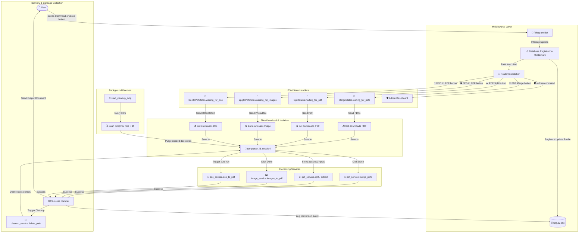
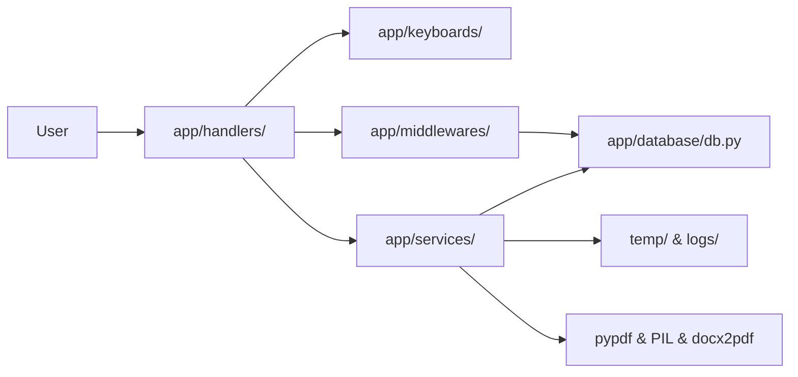
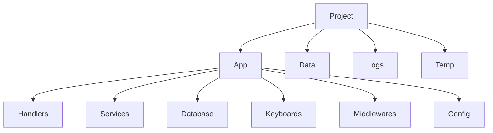

# 🛠️ PDF Tools Bot

[](https://www.python.org/)
[](https://github.com/aiogram/aiogram)
[](https://www.sqlite.org/)
[](LICENSE)

A production-ready, asynchronous Telegram bot built with **Python 3.12+** and **aiogram 3.x**. It allows users to perform various PDF manipulation operations directly inside Telegram, such as merging, splitting, converting images to PDF, and converting Word documents to PDF.

---

## 📌 Full System Flowchart (Tizimning Ishlash Sxemasi)

The diagram below maps the complete lifecycle of a user request—from middleware logging to state-based processing and automated disk cleanup:



---

## 🔍 How the Full Architecture Works (Tizimning Ishlash Prinsipi)

### 1. Request Interception & Identification (So'rovlarni Qabul Qilish va Ro'yxatdan O'tkazish)
- Every incoming message or callback query triggers the `DbMiddleware`.
- The middleware asynchronously checks if the user is registered in the SQLite database (`users` table). If they are new, it inserts their details (User ID, First Name, Username, ISO registration date). If they are existing, it updates their display profile details to keep statistics accurate.

### 2. State Isolation via Finite State Machine (FSM orqali Holatni Boshqarish)
- Since Telegram operations are asynchronous, multiple users can process different files at the same time. The bot keeps track of each user's progress using **Finite State Machine (FSM)**.
- Selecting a tool from the keyboard registers the user's chat into a specific state (e.g. `MergeStates.waiting_for_pdfs`). Until they cancel or complete the sequence, their inputs are processed solely by that state's handler.

### 3. Isolated Disk Storage (Fayllarni Izolyatsiyalash)
- To prevent upload conflicts between users (or different conversions from the same user), the bot generates a unique session ID (`uuid4`) for each process.
- All downloaded files are stored under an isolated path: `temp/{user_id}_[operation]_{session_id}/`.

### 4. Asynchronous Core Services (Asinxron Xizmatlar)
- Processing large files is CPU-bound (converting images, merging PDFs, interacting with MS Word APIs). Running these directly inside `asyncio` would block the main event loop, causing the bot to freeze for other users.
- The bot wraps all file processing inside `asyncio.to_thread` (which executes CPU tasks on a background threadpool), keeping the bot responsive to other requests.
- **DOC to PDF on Windows:** Uses Microsoft Word's COM interface. The thread is safely isolated and calls `pythoncom.CoInitialize()` and `pythoncom.CoUninitialize()` to prevent COM thread-affinity errors.

### 5. Delivery, Accounting & Garbage Collection (Tashish va Tozalash Tizimi)
- Once the output file (PDF, ZIP, or split pages) is ready, it is dispatched back to the user chat via Telegram's Document Sender.
- Upon successful delivery, the database logs the conversion type, increments the user's `conversion_count`, and triggers a cleanup routine that immediately deletes the temporary session folder.
- A secondary background daemon (`start_cleanup_loop`) runs globally every 30 minutes to scan the `temp/` folder and delete any abandoned files older than 1 hour.

---

## ✨ Features List

- **📎 PDF Merge:** Combine multiple PDFs in the exact upload order.
- **✂️ PDF Split:** Extract specific pages (`1, 3, 5`), range selections (`1-3, 5-8`), or split every page (delivering a single ZIP archive for files > 3 pages).
- **🖼️ JPG(s) → PDF:** Upload images (compressed or documents) and convert them to a high-quality PDF with automatic dimensions calculations.
- **📄 DOC → PDF:** High-fidelity Word to PDF conversion preserving styles and structure.
- **🧹 Temp Cleanup:** Safe, isolated file deletes and automated daemon cleaning.
- **🛡️ Admin Panel:** Authorized users can run `/admin` to see registration counts, total operations logs, active daily sessions, and trigger rich-text announcements broadcasts with progress counters.

---

## 🏗️ High-Level Component Architecture (Qatlamlar Arxitekturasi)



---

## 📁 Project Structure Diagram (Loyiha Tuzilishi)



Detailed layout:
```text
pdf-tools-bot/
│
├── bot.py                  # Entrypoint: sets up bot, dispatcher, and run loops
├── requirements.txt        # Package dependencies
├── README.md               # Documentation
├── .env.example            # Environment variables example template
├── .gitignore              # Files ignored by Git
│
├── app/
│   ├── config/             # System config loading & path checks
│   │   └── config.py
│   ├── database/           # Asynchronous SQLite initialization & queries
│   │   └── db.py
│   ├── filters/            # Command filters (e.g. IsAdmin filter)
│   │   └── admin.py
│   ├── handlers/           # FSM state flows & Telegram commands
│   │   ├── admin.py
│   │   ├── common.py
│   │   ├── doc2pdf.py
│   │   ├── jpg2pdf.py
│   │   ├── merge.py
│   │   └── split.py
│   ├── keyboards/          # Inline and reply keyboard configs
│   │   ├── inline.py
│   │   └── menu.py
│   ├── middlewares/        # Automated user profile logger middleware
│   │   └── db_middleware.py
│   ├── services/           # File converters, manipulation services, and cleaners
│   │   ├── cleanup_service.py
│   │   ├── doc_service.py
│   │   ├── image_service.py
│   │   └── pdf_service.py
│   └── utils/              # Helper utilities
│
├── data/                   # SQLite database persistent storage
├── logs/                   # Log output files
└── temp/                   # Session-isolated conversion folders
```

---

## 🚀 Installation Guide

### Prerequisites
- Python 3.12 or newer installed.
- Microsoft Word (required only on Windows host systems for DOC/DOCX conversion).

### Setup Steps
1. **Clone the Repository:**
   ```bash
   git clone https://github.com/mamurjondeveloper/PDF-Tools-bot.git
   cd PDF-Tools-bot
   ```

2. **Create and Activate a Virtual Environment:**
   ```bash
   python -m venv venv
   # On Windows:
   venv\Scripts\activate
   # On Linux/macOS:
   source venv/bin/activate
   ```

3. **Install Dependencies:**
   ```bash
   pip install -r requirements.txt
   ```

---

## ⚙️ Configuration Guide

1. Copy the example configuration template to create your `.env` file:
   ```bash
   copy .env.example .env
   ```
2. Open the `.env` file and fill in the values:
   - `BOT_TOKEN`: The API token generated from [@BotFather](https://t.me/BotFather).
   - `ADMIN_IDS`: A comma-separated list of Telegram user IDs authorized to access admin stats and broadcasts (e.g. `123456789,987654321`).
   - `LOG_LEVEL`: Output logging level (`DEBUG`, `INFO`, `WARNING`, `ERROR`).

---

## 🏃 Running Instructions

To launch the bot, execute the entrypoint script:
```bash
python bot.py
```

---

## 📸 Screenshots

*Place screenshot images of the main menu, file uploading, splitting, and admin panels here.*

---

## 🔒 Security Notes

- **FSM State Preservation:** The Finite State Machine uses `MemoryStorage` in this configuration. If the bot crashes, user states will reset. For heavy production deployments with multiple instances, configure a Redis storage backend.
- **Access Privilege Control:** The admin router handles authorization locally via user-ID filtering. Make sure your `ADMIN_IDS` configuration is kept private.
- **Temp Directory Permissions:** Ensure the execution user has read, write, and execute permissions on the `temp/` folder.

---

## 🗺️ Roadmap

- [ ] Support Excel to PDF conversion (`.xls`, `.xlsx`).
- [ ] Support PowerPoint to PDF conversion (`.ppt`, `.pptx`).
- [ ] Add PDF compression utilities.
- [ ] Add watermark stamp overlays.
- [ ] Add password encryption and locking features.
- [ ] Add PDF page rotation.
- [ ] Support PDF metadata editing.

---

## 📄 License

This project is licensed under the MIT License - see the [LICENSE](LICENSE) file for details.
