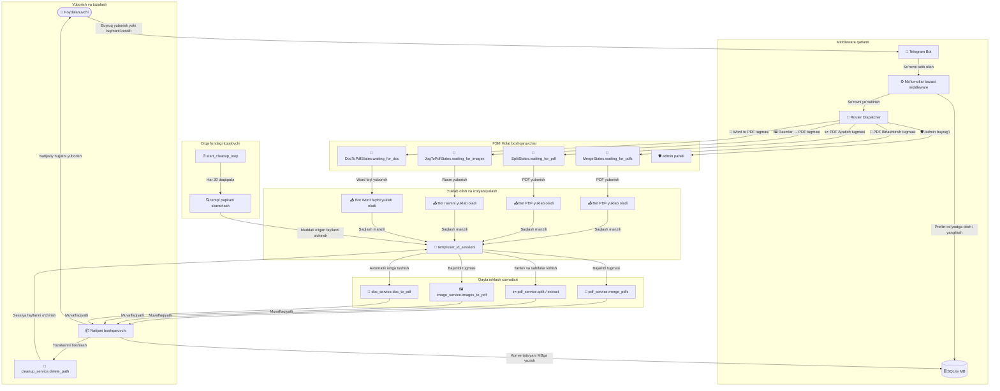
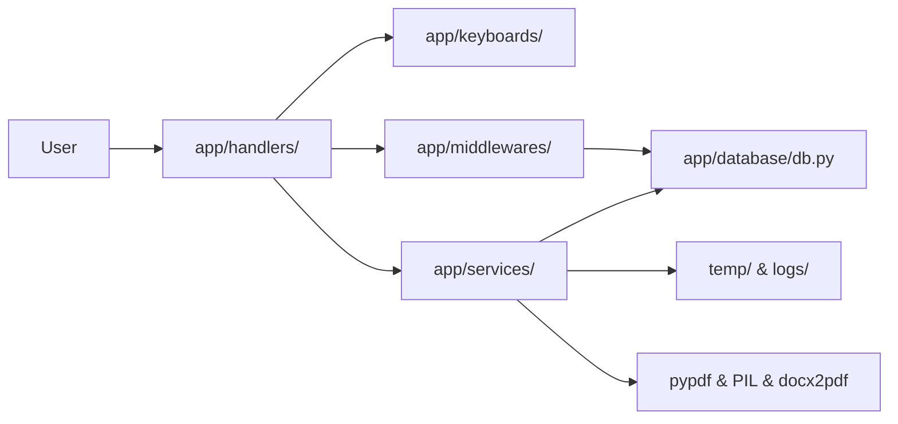
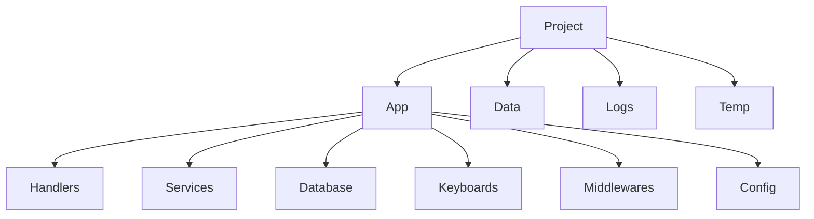

# 🛠️ PDF Tools Bot

[](https://www.python.org/)
[](https://github.com/aiogram/aiogram)
[](https://www.sqlite.org/)
[](LICENSE)

**PDF Tools Bot** — bu Python 3.12+ va aiogram 3.x kutubxonalari asosida yaratilgan, ishlab chiqarishga tayyor (production-ready) asinxron Telegram botdir. U foydalanuvchilarga bevosita Telegram ichida PDF-fayllarni birlashtirish, sahifalarga ajratish, rasmlarni PDF formatiga aylantirish va Word hujjatlarini PDF-ga o'tkazish imkoniyatini beradi.

---

## 📌 Tizimning to'liq ishlash sxemasi (Flowchart)

Quyidagi diagrammada foydalanuvchi so'rovini qabul qilishdan boshlab, ma'lumotlar bazasiga yozish, holatlarni FSM orqali boshqarish, fayllarni qayta ishlash va tizim tozalashgacha bo'lgan barcha bosqichlar tasvirlangan:



---

## 🔍 Tizim arxitekturasi qanday ishlaydi?

### 1. So'rovlarni tutib olish va ro'yxatga olish (DbMiddleware)
- Botga kelgan har bir xabar yoki tugma bosilishi (Callback Query) dastlab `DbMiddleware` orqali o'tadi.
- Middleware foydalanuvchining ID-raqami orqali SQLite ma'lumotlar bazasini tekshiradi. Agar foydalanuvchi yangi bo'lsa, tizim uni avtomatik ravishda ro'yxatga oladi, aks holda uning profil ma'lumotlarini (ismi va taxallusi) yangilaydi.

### 2. Sessiyalarni izolyatsiyalash (FSM va Temp)
- Ko'p foydalanuvchilar botdan bir vaqtda foydalanganda bir-birining fayllariga xalaqit bermasligi uchun **Finite State Machine (FSM)** tizimi ishlatiladi. Foydalanuvchi ma'lum bir amalni boshlaganida (masalan, birlashtirish), bot uning chat holatini ma'lum bir rejimga o'tkazadi va keyingi yuborilgan fayllar faqat shu rejim doirasida ishlov beriladi.
- Har bir sessiya uchun alohida vaqtinchalik papka yaratiladi: `temp/{user_id}_[operation]_[session_id]/`.

### 3. Asinxron qayta ishlash xizmatlari
- PDF va rasmlarni qayta ishlash, shuningdek Microsoft Word orqali PDF yaratish jarayonlari protsessorga (CPU) katta yuklama beradi. Ushbu og'ir vazifalar asosiy asinxron oqimni (event loop) bloklab qo'ymasligi va boshqa foydalanuvchilarga xalaqit bermasligi uchun barcha operatsiyalar `asyncio.to_thread` yordamida alohida orqa fon threadlarida bajariladi.
- **Windows tizimida Word fayllarini konvertatsiya qilish:** Microsoft Word COM interfeysi orqali asinxron ravishda boshqariladi. Oqimlar bilan ishlashda xatoliklar yuz bermasligi uchun thread ichida `pythoncom.CoInitialize()` va `pythoncom.CoUninitialize()` chaqiriladi.

### 4. Avtomatik tozalash tizimi
- Foydalanuvchiga natijaviy fayl muvaffaqiyatli yuborilishi bilan, ushbu sessiyaga tegishli vaqtinchalik papka va undagi barcha yuklangan fayllar `cleanup_service.delete_path` orqali zudlik bilan o'chiriladi.
- Agar foydalanuvchi jarayonni chala qoldirib ketgan bo'lsa, orqa fondagi `start_cleanup_loop` xizmati har 30 daqiqada `temp/` papkasini tekshirib, 1 soatdan ko'p vaqt davomida turgan eski vaqtinchalik fayllarni tozalaydi.

---

## ✨ Imkoniyatlar ro'yxati

- **📎 PDF Birlashtirish:** Bir nechta PDF hujjatlarini yuklang, ular yuborilgan tartibida bitta faylga birlashtiriladi.
- **✂️ PDF Ajratish:** Sahifalarni yakka-yakka ajratish (agar 3 tadan ko'p sahifa bo'lsa, avtomatik ZIP arxiv shaklida yuboradi), belgilangan sahifa oralig'ini kesib olish (masalan, `1-3, 5-8`) yoki tanlangan sahifalarni ajratib olish (masalan, `1, 3, 5`).
- **🖼️ Rasmlar → PDF:** Istalgan formatdagi rasmlarni (JPG, JPEG, PNG) siqilgan foto yoki fayl ko'rinishida yuboring va ularni sahifalari avtomatik moslashtirilgan PDF shaklida oling.
- **📄 Word → PDF:** `.doc` va `.docx` Word hujjatlarini o'z formati va shriftlarini saqlagan holda PDF-ga o'tkazing (Microsoft Word o'rnatilgan Windows server talab etiladi).
- **🧹 Avtomatik Tozalash:** Tizim xotirasini tejash uchun ishlov berilgan barcha fayllarni bir zumda tozalash va eski tashlab ketilgan fayllarni avtomatik o'chirish tizimi.
- **🛡️ Admin Paneli:** Ruxsat etilgan adminlar `/admin` buyrug'i orqali foydalanuvchilar soni, umumiy operatsiyalar, kunlik faollik hisobotlarini ko'rishi hamda barcha foydalanuvchilarga (matn, rasm, fayl, tugmalardan iborat) reklama xabarlarini yuborishi mumkin.

---

## 🏗️ Komponentlar arxitekturasi



---

## 📁 Loyiha tuzilishi diagrammasi



Batafsil tuzilishi:
```text
pdf-tools-bot/
│
├── bot.py                  # Kirish nuqtasi: bot, dispatcher va orqa fon vazifalarini sozlaydi
├── requirements.txt        # Zaruriy kutubxonalar ro'yxati
├── README.md               # Loyiha qo'llanmasi (hujjat)
├── .env.example            # Sozlamalar andozasi
├── .gitignore              # Git tomonidan hisobga olinmaydigan fayllar ro'yxati
│
├── app/
│   ├── config/             # Tizim sozlamalarini yuklash va tekshirish
│   │   └── config.py
│   ├── database/           # Asinxron SQLite bazasi bilan ishlash
│   │   └── db.py
│   ├── filters/            # Ruxsatlarni tekshirish (masalan, Adminlikni tekshirish)
│   │   └── admin.py
│   ├── handlers/           # FSM rejimlar va Telegram hodisalari
│   │   ├── admin.py
│   │   ├── common.py
│   │   ├── doc2pdf.py
│   │   ├── jpg2pdf.py
│   │   ├── merge.py
│   │   └── split.py
│   ├── keyboards/          # Tugmalar va menyular sozlamalari
│   │   ├── inline.py
│   │   └── menu.py
│   ├── middlewares/        # Foydalanuvchilarni bazaga yozuvchi middleware
│   │   └── db_middleware.py
│   ├── services/           # Fayllarni aylantirish va tozalash xizmatlari
│   │   ├── cleanup_service.py
│   │   ├── doc_service.py
│   │   ├── image_service.py
│   │   └── pdf_service.py
│   └── utils/              # Yordamchi instrumentlar
│
├── data/                   # SQLite ma'lumotlar bazasi fayllari saqlanadigan papka
├── logs/                   # Bot log fayllari papkasi
└── temp/                   # Sessiyaga tegishli vaqtinchalik papkalar
```

---

## 🚀 O'rnatish yo'riqnomasi

### Tizim talablari
- Python 3.12 yoki undan yuqori versiya.
- Microsoft Word (faqat Windows serverda Word-dan PDF-ga o'tkazish xizmati uchun talab etiladi).

### Loyihani sozlash bosqichlari
1. **Loyihani yuklab oling (Clone):**
   ```bash
   git clone https://github.com/mamurjondeveloper/PDF-Tools-bot.git
   cd PDF-Tools-bot
   ```

2. **Virtual muhit yaratish va faollashtirish:**
   ```bash
   python -m venv venv
   # Windows tizimida:
   venv\Scripts\activate
   # Linux/macOS tizimida:
   source venv/bin/activate
   ```

3. **Zarur kutubxonalarni o'rnatish:**
   ```bash
   pip install -r requirements.txt
   ```

---

## ⚙️ Konfiguratsiya (Sozlash)

1. Loyihadagi `.env.example` faylini nusxalab, `.env` deb nomlang:
   ```bash
   copy .env.example .env
   ```
2. `.env` faylini ochib, sozlamalarni kiriting:
   - `BOT_TOKEN`: [@BotFather](https://t.me/BotFather) orqali olingan bot tokeni.
   - `ADMIN_USERNAMES`: Admin huquqlariga ega bo'lgan foydalanuvchilarning Telegram foydalanuvchi nomlari (usernames) ro'yxati (vergul bilan ajratilgan, masalan: `username1,username2`).
   - `LOG_LEVEL`: Log yozish darajasi (`DEBUG`, `INFO`, `WARNING`, `ERROR`).

---

## 🏃 Ishga tushirish

Botni ishga tushirish uchun quyidagi buyruqni bajaring:
```bash
python bot.py
```

---

## 📸 Skrinshotlar

*Bu yerda bot menyusi, fayllarni yuklash, ajratish hamda admin paneliga tegishli skrinshotlar joylashtiriladi.*

---

## 🔒 Xavfsizlik qoidalari

- **FSM Holatlarini Saqlash:** Bot foydalanuvchi holatlarini tezkor xotirada (`MemoryStorage`) saqlaydi. Agar bot o'chib yonsa, foydalanuvchi holatlari bekor qilinadi. Katta yuklamali loyihalarda buni Redis bazasiga bog'lash tavsiya etiladi.
- **Admin Huquqlari:** Admin buyruqlari qat'iy ravishda kiritilgan ID raqamlari orqali tekshiriladi. `.env` sozlamalari va ma'lumotlar bazasi maxfiyligini saqlang.
- **Vaqtinchalik Papka Huquqlari:** Bot vaqtinchalik papkalarni erkin yarata olishi va o'chira olishi uchun `temp/` papkasiga to'liq yozish va o'chirish huquqlari berilgan bo'lishi kerak.

---

## 🗺️ Kelajakdagi rejalar (Roadmap)

- [ ] Excel fayllarini PDF formatiga o'tkazish (`.xls`, `.xlsx`).
- [ ] PowerPoint fayllarini PDF-ga o'tkazish (`.ppt`, `.pptx`).
- [ ] PDF hajmini siqish (compress) xizmati.
- [ ] PDF-ga suv belgilari (watermark) qo'yish.
- [ ] PDF-ni parol bilan himoyalash va blokdan chiqarish.
- [ ] PDF sahifalarini aylantirish (rotate).
- [ ] PDF meta-ma'lumotlarini tahrirlash.

---

## 📄 Litsenziya

Ushbu loyiha MIT litsenziyasi bo'yicha tarqatiladi — batafsil ma'lumot olish uchun [LICENSE](LICENSE) fayliga qarang.
